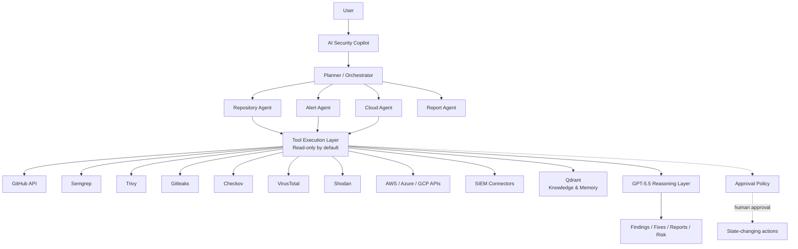

# AI Security Copilot Architecture

## Responsibilities

- The Planner routes work and defines the ordered, reviewable stages.
- Specialized agents analyze repositories, alerts, cloud posture, and reports.
- Tool adapters are read-only by default and return normalized results.
- Qdrant stores retrieval knowledge and approved organizational memory.
- GPT-5.5 performs reasoning, correlation, explanations, and recommendations.
- The approval policy gates all state-changing or destructive actions.

## Data flow

1. A user request enters through the API, CLI, or dashboard.
2. The Planner creates a scoped plan and identifies required agents.
3. Agents call tool adapters and collect evidence.
4. The reasoning layer correlates evidence into findings, risk, and fixes.
5. The Report Agent produces executive, technical, or compliance output.
6. Any state-changing action stops at the approval boundary.

